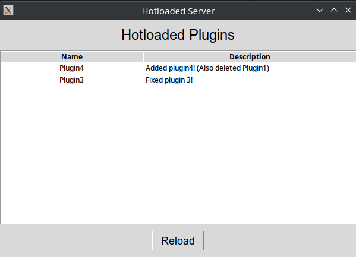

# Hotloading Plugins Project
My 'Hotloading Plugins' project consists of the two repositories 'hotloaded-server' and 'hotloaded-plugins'. The project is a test for having a running server that will update a dependency and reload it dynamically without any necessary downtime.

See [Hotloaded Plugins](https://github.com/BVengo/hotloaded-plugins) for the other repository.

## Usage
1. Clone and fork both this repository and [Hotloaded Plugins](https://github.com/BVengo/hotloaded-plugins)
2. Update the dependency in this package to point to your own hotloaded-plugins version.
3. Install both as you would any other poetry project
4. Run `poetry run main` in your hotloaded-server to load up the GUI. It should show a list of whichever plugins were in your hotloaded-plugins package at the time of setup.
5. Add, modify, or delete plugins in the hotloaded-plugins package. Push the changes to your repository.
6. Press 'Reload' in the GUI to update your venv's version of the hotloaded-plugins and dynamically load in your changes.

## Use-Case
For projects that are dependent on short python scripts which are frequently updated (and need to be immediately deployed), but also need to avoid any downtime. 

Pros:
- No downtime (although a `PLUGINS_UPDATING` flag in the code would be beneficial to temporarily queue up processes)
- Plugins included as a dependency, which means it can be automatically downloaded (and shared dependencies are handled too)
- No need to store both repositories on the server (as would be required for a file-system based setup)
- Make use of source control to track and store plugins code

Cons:
- Unpredictable behaviour if not handled correctly (in-memory objects will still be old)
- Requires two repositories instead of one project that gets re-deployed with a short downtime period. Simply having two services would be more ideal.

### Other Alternatives
There's an obvious alternative to this system which is far more stable - have 2 API services, where #1 is always up and queues interactions with #2.
However this is a fairly normal approach, and I wanted to try out something new.

Other ideas were:
- Reading directly from another project directory, on the same file system
- Storing the scripts in a database, to be dynamically read in

These both felt _too_ unstable, given the plugins were no longer listed as project dependencies and both required an arbitrary storage solution.
